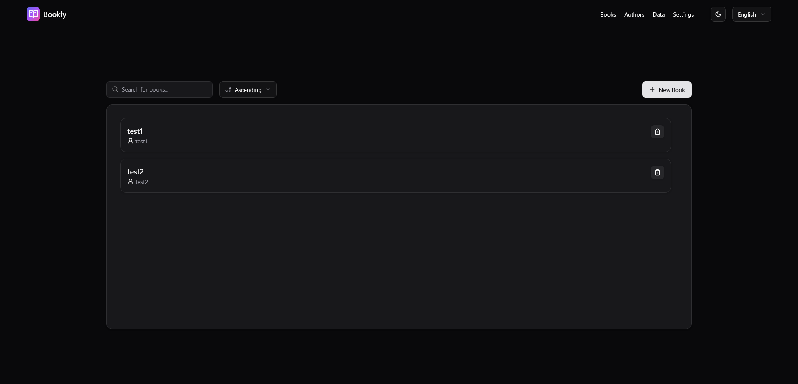

# Bookly


---

> WARNING
> **Work in Progress**: This project is currently under development. Not all features may be fully implemented or working as expected.

Bookly is a modern full-stack web application for managing and browsing your book collection. Built with React, TypeScript, Express.js, and Vite, it features a clean UI with shadcn/ui components, sorting, searching, and comprehensive book management capabilities.



## Features

### 📚 Book Management

- Browse your book collection in a beautiful card layout
- Search for books by title or author
- Sort books in ascending or descending order
- Add and delete books with intuitive dialogs
- Multi-page navigation (Authors, Data, Settings)

### 🎨 Modern UI/UX

- Desktop-focused design with clean interface
- Dark/Light theme support with theme switcher
- Modern UI components powered by shadcn/ui and Radix UI
- Clean navigation with dropdown menus
- Language support with language selection button

### 🛠 Technical Features

- Full-stack architecture with Express.js backend
- React 19 with TypeScript for type safety
- TailwindCSS for utility-first styling
- Vite for fast development and optimized builds
- Component-based architecture with reusable UI elements

## Tech Stack

### Frontend

- **React 19** - Modern React with latest features
- **TypeScript** - Type-safe development
- **Vite** - Fast build tool and dev server
- **TailwindCSS** - Utility-first CSS framework
- **shadcn/ui** - Beautiful and accessible UI components
- **Radix UI** - Primitive UI components
- **React Router DOM** - Client-side routing
- **Lucide React** - Beautiful icons

### Backend

- **Express.js** - Fast and minimal web framework
- **Vite Express** - Integration between Vite and Express
- **Node.js** - JavaScript runtime

## Getting Started

### Prerequisites

- Node.js (v18 or newer recommended)
- pnpm (recommended package manager)

### Installation

1. Clone the repository:

   ```sh
   git clone https://github.com/Salafi-Coders/bookly.git
   cd bookly
   ```

2. Install dependencies for all workspaces:

   ```sh
   pnpm install:all
   ```

3. Start the development server:

   ```sh
   pnpm dev
   ```

4. Open [http://localhost:5173](http://localhost:5173) in your browser.

### Available Scripts

From the root directory:

- `pnpm dev` - Start development server (both client and server)
- `pnpm build` - Build the client for production
- `pnpm start` - Start production server
- `pnpm install:all` - Install dependencies for both client and server
- `pnpm build:production` - Build and start production server

## Project Structure

```text
bookly/
├── client/                 # React frontend application
│   ├── src/
│   │   ├── components/     # Reusable React components
│   │   │   ├── ui/         # shadcn/ui components
│   │   │   ├── books/      # Book-related components
│   │   │   └── navbar/     # Navigation components
│   │   ├── pages/          # Page components (Authors, Data, Settings)
│   │   ├── data/           # Static data files
│   │   ├── lib/            # Utility functions and helpers
│   │   └── assets/         # Static assets (images, logos)
│   ├── public/             # Public static files
│   └── package.json        # Client dependencies and scripts
├── server/                 # Express.js backend
│   ├── server.js           # Main server file
│   └── package.json        # Server dependencies and scripts
└── package.json           # Workspace configuration
```

## Development

### Adding New Components

This project uses shadcn/ui for UI components. To add new components:

```sh
cd client
npx shadcn@latest add [component-name]
```

### Customization

- **Book Data**: Edit `client/src/data/books.json` to modify the book collection
- **UI Styling**: Customize components in `client/src/components/ui/`
- **Theme**: Configure themes in `client/src/components/themeprovider.tsx`
- **API Routes**: Add backend routes in `server/server.js`

### Pages

The application includes multiple pages:

- **Main**: Book collection browser and management
- **Authors**: Author-specific views and management
- **Data**: Data visualization and analytics
- **Settings**: Application configuration and preferences

## License

MIT
